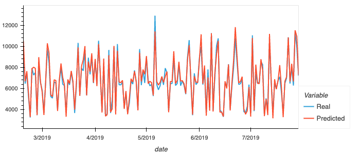
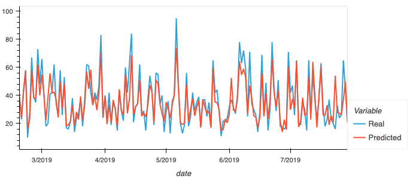

# Bitcoin Price Modeling using Recurring Neural Network 

## Introduction

LSTM is a powerful and flexible deep learning model that can be used to predict the future value of a time series. With all the hype and excitement surrounding cryptocurrencies, we will attempt to build a model that can predict the future value of the Bitcoin price.

## Objective

The objective of this project is to predict the future value of the Bitcoin price using LSTM model. The data is provided in the csv file within the resources folder. The data also contains the fear and greed index data for the same time period as the bitcoin price. 

## Methodology
- We first start by preparing the data and splitting the data into training and testing sets to be ingested by the LSTM model.

- We will then build the basic structure of the LSTM model and use it to predict the future value of the Bitcoin price based on a rolling window of the past 10 periods. 

- We lastly will evaluate the model using and plot the data against the testing data to see how well the model performed.

- This will be repeated for the fear and greed index data in a separate notebook.

## Conclusion and Results

Based on the model results we can conclude the following :

- The model with the lowest observed loss was least when predicting bitcoin closing prices vs the fear and greed index with a loss of 0.0016 vs 0.009

- The model when applied to the bitcoin closing price seems to be tracking it relatively bette the fear and greed index over time. 

### Bitcoin Close Price Model vs Real Data

### Fear and Greed index Model vs Real Data

- The models were tested with varying window sizes ranging from 1 to 10 , while any window size above 2 yielded some sort of fit to the data. in general the model predictions were best with windows above 5 days. it was chosen to keep it at 10 to avoid any potential overfitting by having a wider range of data.

